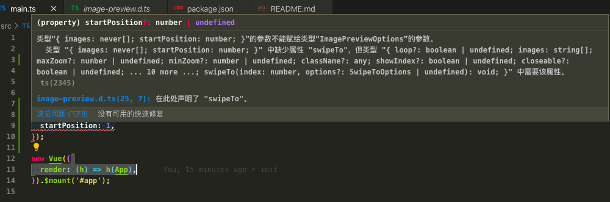

# vant-issue

```
Vue CLI v4.3.1
Failed to check for updates
? Please pick a preset: Manually select features
? Check the features needed for your project: TS, Linter
? Use class-style component syntax? Yes
? Use Babel alongside TypeScript (required for modern mode, auto-detected polyfills, transpiling JSX)? Yes
? Pick a linter / formatter config: TSLint
? Pick additional lint features: Lint on save
? Where do you prefer placing config for Babel, ESLint, etc.? In package.json
? Save this as a preset for future projects? (y/N) n
```

通过脚手架, 生成`typescript`的项目, 引用`vant`的`ImagePreview`有报错. 问题在于这个方法的第一个参数不应该带有`swipeTo`

具体代码看`src/main.ts`.

